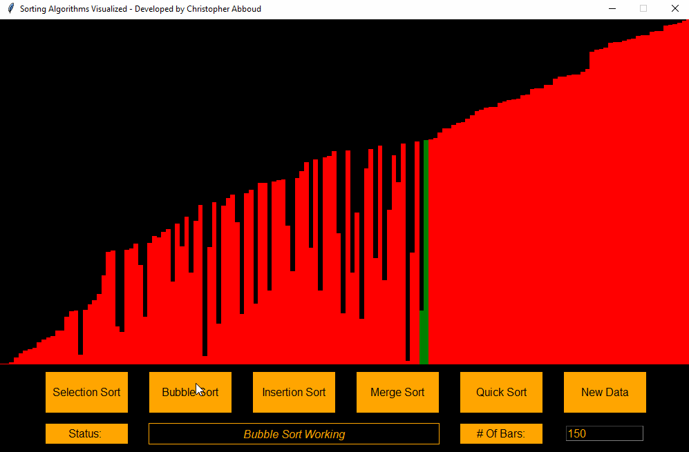

# Sorting Algorithms Visualizer

This software was created for the purpose to easily visualize some of the different popular sorting algorithms. At the moment the software is only able to visualze:
> - Selection Sort
> - Bubble Sort
> - Insertion Sort
> - Merge Sort
> - Quick Sort

More algorithms are planned on being added in the future.

---

## Installation

To ensure that this software will operate on your machine, python must be first installed. Moreover, this software uses a library from John Zelle which is a simple object oriented graphics library. To install this library, please download this [file](https://mcsp.wartburg.edu/zelle/python/graphics.py) into the created folder after you `git clone` the repository. Then, simply run main.py and the software should be useable.

---
## Instructions

To create a fresh batch of data, use the `New Data` button located on the very right. Note that anytime the button is clicked, the number in the text box located under this button will be how many different rectangles are present. So to create a new batch of data with a different number of rectangles, first change the value of the textbox, then click the `New Data` button. Once you have your desired data, simply click any of the available 5 sorting methods and you will be able to visually see them in action.
